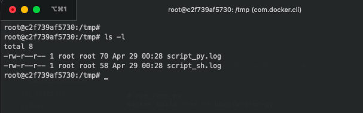
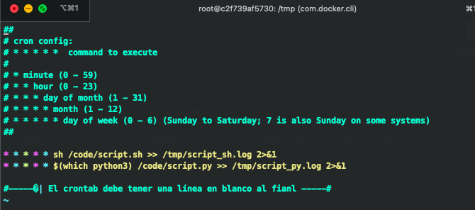

# Docker - cron

Planificar la ejecución de un script en un contenedor de Docker.  
Se ejecutará un scrtip de Python y uno Bash

## Comandos:
_(desde el directorio con el Dockerfile)_

+ Crear imagen: 
	+ `docker build --rm -t ubuntu-cron-py .` 
+ Iniciar contenedor: 
	+ `docker run -ti --rm --name cron_py -d ubuntu-cron-py`
+ Ingresar al contenedor:
	+ `docker exec -it cron_py bash`

+ Ver logs (/tmp):

+ Logs:

## crontab:
`crontab -e`  

Con esta configuración se ejecutarán cada 1 min.
